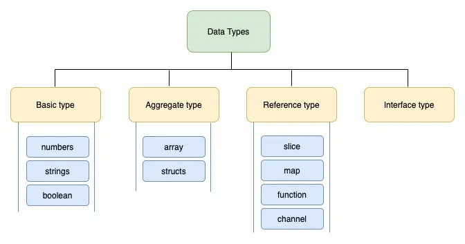
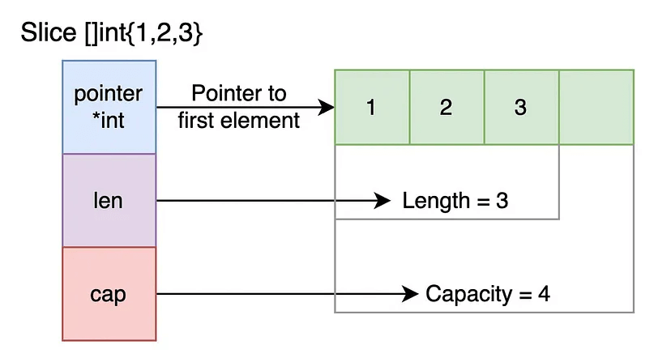

# Go playground

| Branch |                                                                                   Pipeline                                                                                   |                                                                                Code coverage                                                                                 |                                          Test report                                           |                                 SonarCloud                                 |
|:------:|:----------------------------------------------------------------------------------------------------------------------------------------------------------------------------:|:----------------------------------------------------------------------------------------------------------------------------------------------------------------------------:|:----------------------------------------------------------------------------------------------:|:--------------------------------------------------------------------------:|
|  main  | [](https://gitlab.com/ShowMeYourCodeYouTube/go-playground/-/commits/main) | [](https://gitlab.com/ShowMeYourCodeYouTube/go-playground/-/commits/main) | [link](https://showmeyourcodeyoutube.gitlab.io/go-playground/test-report/coverage-report.html) | [link](https://sonarcloud.io/organizations/showmeyourcodeyoutube/projects) |

---

Get familiar with Go!

https://go.dev/

https://play.golang.com/p/lC0mTi8gxbU

Most code samples are based on:
- https://go.dev/tour/list
- https://gobyexample.com/

Coding tasks references:
- [Channels, ranges, pointers](https://medium.com/@ninucium/go-interview-questions-part-1-pointers-channels-and-range-67c61345cf3c)
- [Slices](https://medium.com/@ninucium/go-interview-questions-part-2-slices-87f5289fb7eb)
- StackOverflow problems to solve
  - [Correctly close shared channels in goroutines](https://stackoverflow.com/questions/59018372/how-do-i-correctly-close-shared-channels-in-goroutines-while-processing-results)

## Getting started

1. Install Go
2. Run `go mod tidy`
3. Run `main.go`

## Go

Golang, also known as Go, is a statically typed and compiled programming language created by Google.
It is compiled to binary and a Go binary does not need system dependencies such as Go tooling to run on a new system.
Putting these executables in an executable filepath on your own system will allow you to run the program from anywhere on your system.

A compiled language is a programming language whose implementations
are typically compilers (translators that generate machine code from source code),
and not interpreters (step-by-step executors of source code, where no pre-runtime translation takes place).

Static typing is a typing system where variables are bound to a data type during compilation.
Once a variable is assigned a data type it remains unchanged throughout the program's execution.

> Go compiles to a target OS and CPU architecture.
The result is statically linked so the binary will run almost anywhere that those two values hold true.
[Reference](https://www.quora.com/Is-the-Golang-write-once-run-everywhere-language-like-Java)

When you run a command like go build, Go uses the current platform’s GOOS and GOARCH to determine how to build the binary.
```
go env GOOS GOARCH
```
Running this on Windows will print: `windows amd64`.

[Building Go Applications for Different Operating Systems](https://www.digitalocean.com/community/tutorials/building-go-applications-for-different-operating-systems-and-architectures)

### Data types



[Reference](https://levelup.gitconnected.com/composite-data-types-in-golang-a829288b5553)

### Slices

A slice is a reference type that includes three main components:
- Pointer to the array. This pointer points to the first element of the slice in the underlying array (the `slice` type in Go is an abstraction built over the array type).
- Length. This is the number of stored elements in the slice. The length determines the current size of the slice, and it can be obtained using the len(slice) function.
- Capacity. The capacity of a slice determines how many elements it can contain without the need to expand the underlying array. The capacity can be equal to or larger than the length of the slice, and it can be obtained using the cap(slice) function.

Worth to remember:
- A slice is a reference data type. Inside there is a pointer to the first element of the slice. This factor is what determines how certain operations, even when performed on copies of the slice, can affect the original slice.
- A slice has a length, which describes the number of elements currently stored in the slice, and a capacity, which indicates how many elements can be added to this memory area.
- If the inequality len(x) + 1 <= cap(x) is not met when adding a new element, the slice expands into a new area of memory, and capacity doubles (until it reaches the size of 1024, after which they increase by 25% with each expansion).
- When you pass a slice as an argument to a function as a copy (not via a pointer), you should remember that the slice contains a pointer to the first element, which allows for modifications to the original slice.
- The length and capacity values are passed by copy. If you pass a slice to a function and then the same slice is modified elsewhere in the code (e.g., by adding a new element), it will not affect the length and capacity of the copied slice within the function.



[Reference](https://medium.com/@ninucium/go-interview-questions-part-2-slices-87f5289fb7eb)

More resources:
- [Go docs](https://go.dev/blog/slices-intro)
- [Are slices passed by value?](https://stackoverflow.com/questions/39993688/are-slices-passed-by-value)

### Concurrency

Concurrency refers to the ability of a computer system to perform multiple tasks simultaneously.

Goroutines and Channels are a lightweight built-in feature for 
managing concurrency and communication between several functions executing at the same time.

#### Goroutines

A goroutine is a lightweight thread managed by the Go runtime. [Docs](https://go.dev/tour/concurrency/1)

#### Channels

A Channel is a built-in data structure that allows Goroutines to communicate and synchronize their activities. 
Channels provide a way to send and receive values between Goroutines in a safe and efficient way, 
without the need for locks or other synchronization primitives.

Channels can be used to communicate between Goroutines by sending and receiving values. 
The <- operator is used to send and receive values on a channel. 
For example, to send a value on a channel, you would write `channel <- value`. 
To receive a value from a Channel, you would write `value := <-channel`.

#### Benefits of Goroutines/Channels

- Goroutines are extremely lightweight, requiring only a few kilobytes of memory compared to the several megabytes required by traditional threads. This means that Go programs can create and manage a large number of Goroutines without incurring significant memory overhead, leading to improved performance and scalability.
- using Goroutines in Go also simplifies synchronization between concurrent activities. Unlike traditional thread synchronization mechanisms like locks and semaphores, Goroutines can be synchronized using channels, which are simpler and more intuitive to use. Channels help to avoid race conditions and deadlocks by ensuring that data is safely shared between Goroutines.
